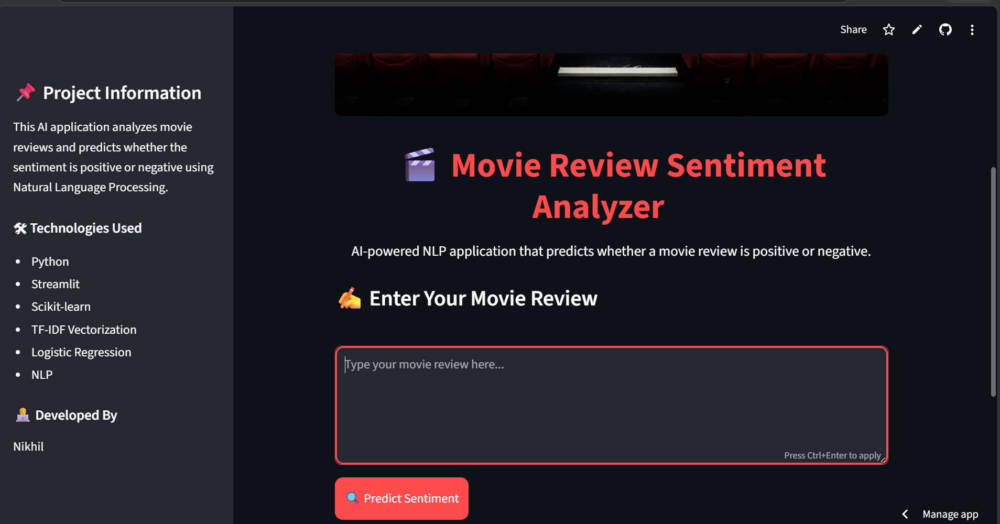
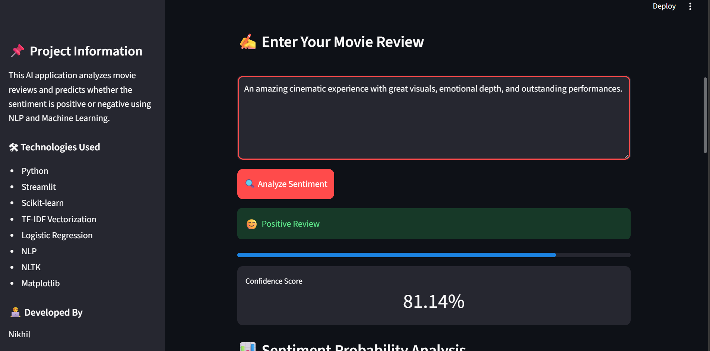
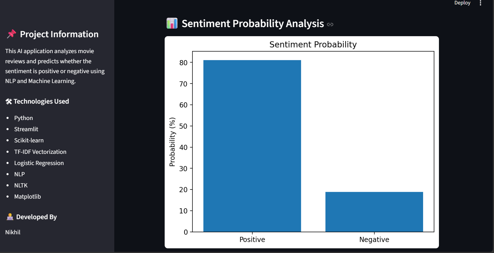
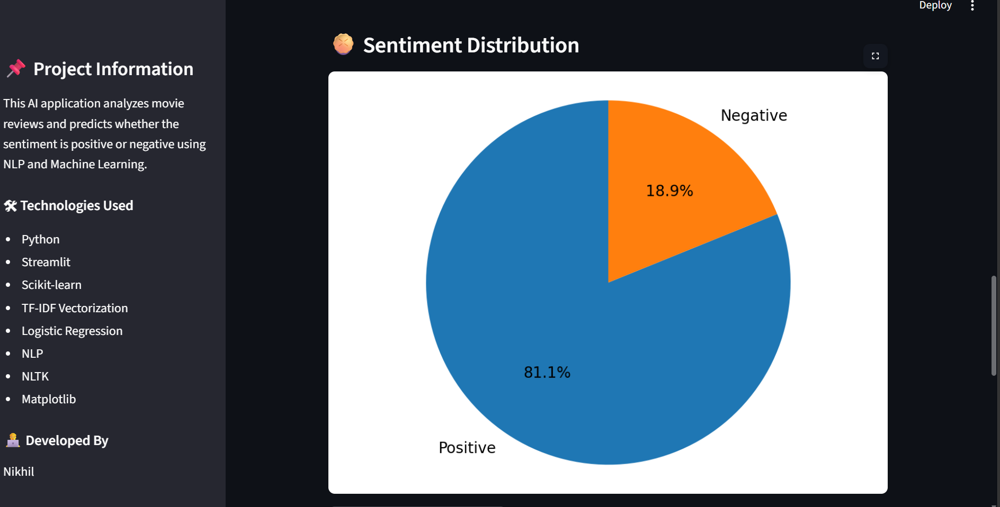
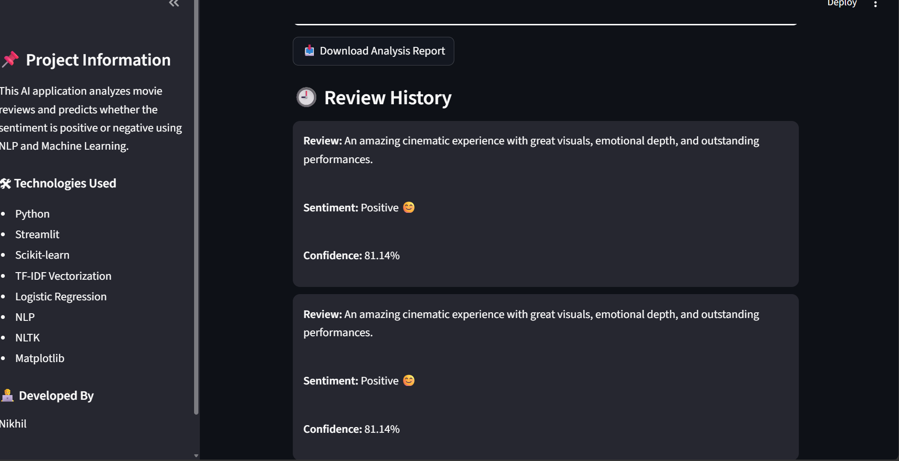

# 🎬 Movie Review Sentiment Analysis

An AI-powered web application that analyzes movie reviews and predicts whether the sentiment is **Positive 😊** or **Negative 😡** using **Natural Language Processing (NLP)** and **Machine Learning**.

---

## 🚀 Live Demo

🌐 Streamlit App: https://cine-zone.streamlit.app/

---

## 📌 Features

- ✅ AI-powered sentiment prediction
- ✅ NLP text preprocessing
- ✅ TF-IDF vectorization
- ✅ Logistic Regression model
- ✅ Interactive Streamlit web interface
- ✅ Confidence score visualization
- ✅ Sentiment probability progress bar
- ✅ Sentiment probability bar chart
- ✅ Sentiment distribution pie chart
- ✅ Review history tracking
- ✅ Downloadable sentiment analysis reports
- ✅ Modern dark-themed UI
- ✅ Real-time prediction system

---

## 🛠 Technologies Used

### Programming Language
- Python

### Libraries & Frameworks
- Streamlit
- Scikit-learn
- Pandas
- NumPy
- NLTK
- Matplotlib
- Pickle
- Regex (re)

### Machine Learning Concepts
- Natural Language Processing (NLP)
- TF-IDF Vectorization
- Logistic Regression
- Text Classification
- Sentiment Analysis

---

# 📷 Application Screenshots

---

## 🏠 Home Page



---

## ✍️ Review Input Section



---

## 📊 Sentiment Probability Bar Chart



---

## 🥧 Sentiment Distribution Pie Chart



---

## 🕘 Review History Section



---

# ⚙️ Project Workflow

```text
User Review
     ↓
Text Cleaning
     ↓
TF-IDF Vectorization
     ↓
Machine Learning Model
     ↓
Sentiment Prediction
     ↓
Visualization & Report Generation
```

---

# 🧠 How It Works

### 1️⃣ User Input
The user enters a movie review through the Streamlit web interface.

### 2️⃣ Text Preprocessing
The review text is cleaned using:
- Lowercasing
- Special character removal
- Stopword removal

### 3️⃣ Feature Extraction
TF-IDF Vectorization converts text into numerical vectors.

### 4️⃣ Prediction
The Logistic Regression model predicts:
- Positive Sentiment
- Negative Sentiment

### 5️⃣ Visualization
The application displays:
- Confidence score
- Progress bar
- Bar chart
- Pie chart
- Review history

### 6️⃣ Report Generation
Users can download the sentiment analysis report.

---

# 📂 Project Structure

```text
Movie-Review-Sentiment-Analysis/
│
├── app.py
├── sentiment_model.pkl
├── tfidf_vectorizer.pkl
├── requirements.txt
├── README.md
│
├── images/
│   ├── app_screenshot.png
│   ├── review_section.png
│   ├── graph.png
│   ├── piechart.png
│   └── history.png
│
├── notebook/
│   └── sentiment_analysis.ipynb
│
└── .venv/
```

---

# ▶️ Installation & Setup

## 1️⃣ Clone Repository

```bash
git clone https://github.com/kummaranikhil/Movie-Review-Sentiment-Analysis.git
```

---

## 2️⃣ Move Into Project Folder

```bash
cd Movie-Review-Sentiment-Analysis
```

---

## 3️⃣ Install Dependencies

```bash
pip install -r requirements.txt
```

---

## 4️⃣ Run Streamlit App

```bash
streamlit run app.py
```

---

# 📈 Future Improvements

- 🔥 Transformer-based sentiment analysis
- 🔥 Hugging Face integration
- 🔥 Movie recommendation system
- 🔥 User authentication
- 🔥 Database integration
- 🔥 Cloud storage support
- 🔥 AI chatbot integration

---

# 👨‍💻 Developed By

## Nikhil

AI & ML Enthusiast | Python Developer | DATA Science Intern

---

# 🌟 Show Your Support

If you liked this project:

⭐ Star this repository  
🍴 Fork this repository  
📢 Share it with others

---

# 📄 License

This project is developed for educational and learning purposes.